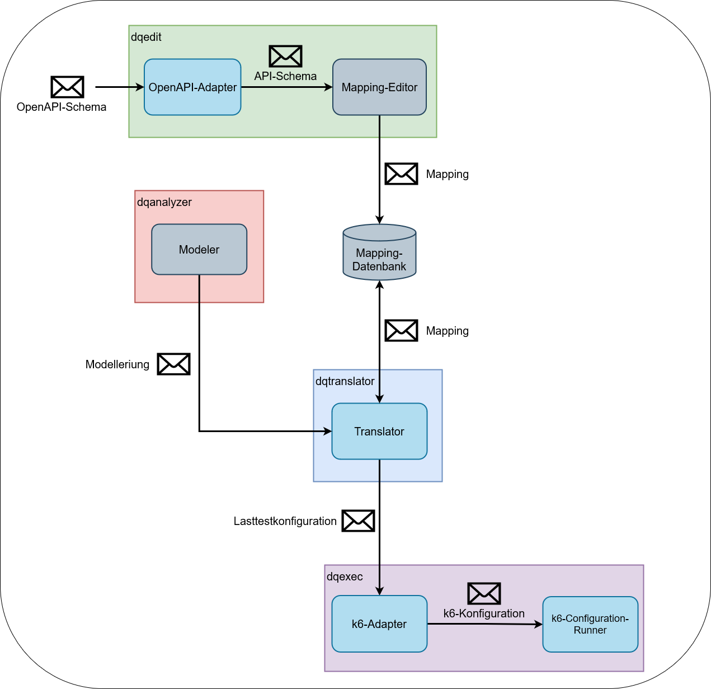

# Loadtest Translator Prototype (Bachelor Thesis)

---
## Summary

This prototype demonstrates how it´s possible to translate a 
subject modeling with the help of an architecture mapping to a load test 
configuration. Additionally, the test configuration will be turned into 
k6 scripts, which will be executed. The test results will be exported to an
influxDB and can be viewed in Grafana.

The prototype consists of the following modules:

- [ddd-autohaus](https://github.com/dqualizer/loadtest-translator-prototype/tree/main/ddd-autohaus-tactical-design-werkstattauftrag):
A DDD-environment to create an architecture mapping for and to run load tests on (forked from [domain-driven-design-werkstatt](https://github.com/MatthiasEschhold/domain-driven-design-werkstatt) by Matthias Eschold).

- [leasingninja](https://github.com/dqualizer/loadtest-translator-prototype/tree/main/leasingninja):
A foreign DDD-environment to create an architecture mapping for and to run load tests on, which is not fully implemented yet
(forked from [leasingjinja-java-boundedcontexts-domainmodel](https://github.com/leasingninja/leasingninja-java-boundedcontexts-domainmodel) by Henning Schwentner).

- [openapi-adapter](https://github.com/dqualizer/loadtest-translator-prototype/tree/main/openapi-adapter):
A demonstrative component to adapt an OpenAPI-schema to a _**dqlang**_-API-Schema.

- [modeler-mock](https://github.com/dqualizer/loadtest-translator-prototype/tree/main/modeler-mock):
A mocked component of _**dqedit**_ that is used to produce a modeling.

- [loadtest-translator](https://github.com/dqualizer/loadtest-translator-prototype/tree/main/loadtest-translator):
One part of _**dqtranslator**_ that is responsible for combining the modeling 
with the mapping and produce a _**dqlang**_-load-test-configuration from it.

- [k6-adapter](https://github.com/dqualizer/loadtest-translator-prototype/tree/main/k6-adapter):
A component used to adapt a _**dqlang**_-load-test-configuration into a configuration
better suited for the load testing tool [k6](https://k6.io/docs/).

- [k6-configuration-runner](https://github.com/dqualizer/loadtest-translator-prototype/tree/main/k6-configuration-runner):
A component that transforms adapted load test configuration into k6 scripts.
These scripts will be executed. The test results will be exported to InfluxDB(v2) and
can be viewed in Grafana.
---
Following external tools have been used:

- RabbitMQ: A message-broker used for communicating between different modules.

- InfluxDB: A time series database used to store result metrics of load tests.

- Grafana: A visualization tool used to visualize the load test results.

---
## How to run

> Start the whole application with _ddd-autohaus_ as DDD-environment with: `docker-compose up --build`

> Start the whole application with _leasingninja_ as DDD-environment with: `docker-compose -f .\docker-compose-evaluation.yml up --build`
>
> Inside [docker-compose-evaluation.yml](https://github.com/dqualizer/loadtest-translator-prototype/blob/main/docker-compose-evaluation.yml) 
> you can change the _modeling-file_ for the modeler-mock.

> To use the _openapi-adapter_, start _ddd-autohaus-tactical-design-werkstattauftrag_ first and then _openapi-adapter_, both with `mvn spring-boot:run`

---
## Output

In the console you can see log messages, which will show you information about the current state of the
prototype.

Additionally, inside the [docker-output](docker-output) folder all created k6-scripts as well as
the console output of k6 are saved. The k6-scripts are saved as js-files. 
The k6-console output is saved in txt-files. For every time a new loadtest starts or a loadtest is repeated, a new logging
file will be used.

---
## Component Overview

---
## Further information

#### InfluxDB (v2)

URL: `localhost:8086`
Default login: username > k6,  password > telegraf

You can change the login in the [.env](env/.env) file.
The organization, bucket and token are configured here, too.

---
#### Grafana

URL: `localhost:3030`
Default login: username > admin, password > admin

You can view the test results in the dashboard: [Load_Test_Results](docker-config/grafana/my-dashboards/home.json)
